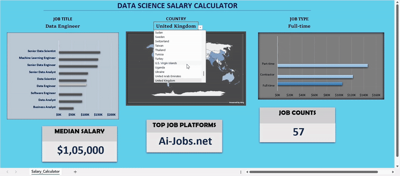
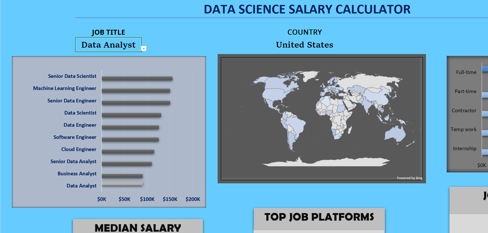
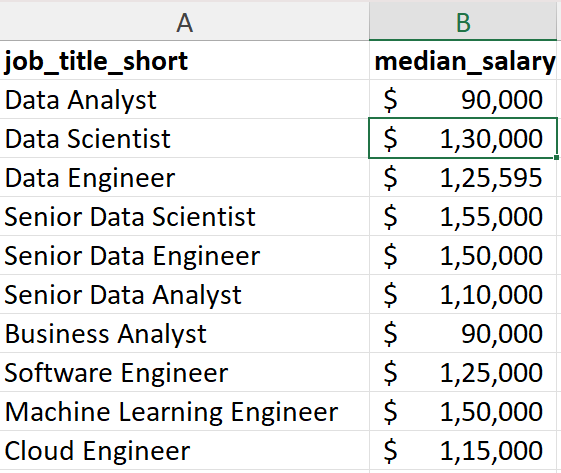
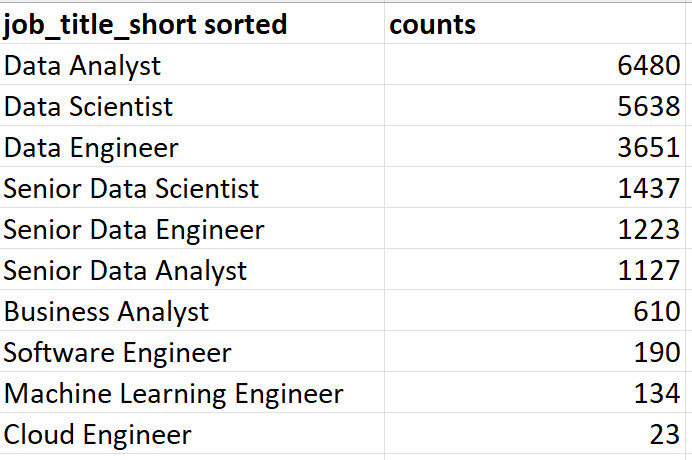

# Excel-Salary-Calculator




## Project Overview
--
This Project analyzes 32,000+ employees across 100+ countries, enabling users to explore median salaries, top job platforms, and role-based hiring trends through dynamic charts and KPIs Cards.

### Dashboard File:

My Final Dashboard is in [Excel_Dashboard.xlsx](Excel_Dashboard_Project1.xlsx)

### Key Features:

-**Interactive Visuals:** 
Clustered bar charts for job titles and job types
Map chart showing global geographic distribution
KPI cards displaying median salary, top job platforms, and total job counts

-**Dynamic Filtering:** Users can filter by country, job type, or role to instantly view updated insights.

-**Advanced Excel Functions:** Utilizes MEDIAN, SORT, FILTER, ISNUMBER, UNIQUE, VLOOKUP, Data Validation, formulas, and charts for accurate calculations and professional visualization.

-**Business Value:** Enables recruiters and job seekers to make informed decisions based on real-world trends in the data science job market.

---

### Excel Skills Used

*Excel*: Pivot Tables, Functions, Charts, Formulas, Data Validation

*Data Visualization*: Interactive dashboards for actionable insights

*Analytical Thinking*: Understanding global trends and making data-driven decisions

---

## Data Jobs Datasets

The dataset used for this project contains real-world data science job information from 2023.  It includes detailed information on:

- **👨‍💼 Job titles**
- **💰 Salaries**
- **📍 Locations**
- **🛠️ Skills**

## Dashboard Build

### 📉 Charts

#### 📊 Data Science Job Salaries - Bar Chart

- 🛠️ **Excel Features:** Utilized bar chart feature (with formatted salary values) and optimized layout for clarity.
- 🎨 **Design Choice:** Horizontal bar chart for visual comparison of median salaries.
- 📉 **Data Organization:** Sorted job titles by descending salary for improved readability.
- 💡 **Insights Gained:** This enables quick identification of salary trends, noting that Senior roles and Engineers are higher-paying than Analyst roles.




#### 🗺️ Country Median Salaries - Map Chart

 🛠️ **Excel Features:** Utilized Excel's map chart feature to plot median salaries globally.
- 🎨 **Design Choice:** Color-coded map to visually differentiate salary levels across regions.
- 📊 **Data Representation:** Plotted median salary for each country with available data.
- 👁️ **Visual Enhancement:** Improved readability and immediate understanding of geographic salary trends.
- 💡 **Insights Gained:** Enables quick grasp of global salary disparities and highlights high/low salary regions.

### 🧮 Formulas and Functions

#### 💰 Median Salary by Job Titles

```
=MEDIAN(
IF(
    (jobs[job_title_short]=A2)*
    (jobs[job_country]=country)*
    (ISNUMBER(SEARCH(type,jobs[job_schedule_type])))*
    (jobs[salary_year_avg]<>0),
    jobs[salary_year_avg]
)
)
```


- **Multiple Criteria Filtering:**
This formula calculates the median yearly salary of employees for a specific job title (A2), in a specific country, with a specific job schedule type (like Full-time/Remote), ignoring Blank salaries

- **Table**

  



#### ⏰ Count of Jobs

```
=COUNT(
  IF(
    (jobs[job_country] = country) *
    (jobs[job_title_short] = M10) *
    (ISNUMBER(SEARCH(type, jobs[job_schedule_type]))),
    jobs[salary_year_avg]
  )
)
```
This formula counts how many jobs match a set of specific conditions. It looks at the dataset and checks three things for each row:
1. Whether the job’s country matches the selected country,
2. Whether the job’s title matches the one chosen in cell M10, and
3. Whether the job’s schedule type contains the selected type (like full-time, part-time, etc.).



### **👨‍💼 count of job schedule types**
```
=FILTER(J2#,(NOT(ISNUMBER(SEARCH("and",J2#))+ISNUMBER(SEARCH(",",J2#))))*(J2#<>0))

```

This Excel formula below employs the FILTER() function to exclude entries containing "and" or commas, and omit zero values.

**🔒 Smarter Data Validation:** By applying the filtered list to the Job Title, Country, and Type fields, the dashboard ensures:

🎯 Inputs are limited to predefined, valid options

🚫 Errors and inconsistencies are avoided

👥 A cleaner and more user-friendly experience is maintained

---

## Conclution

This project strengthened my Excel, data visualization, and analytical skills, while allowing me to explore global data patterns in the data science domain and present actionable insights in a user-friendly format.


---
